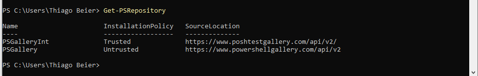
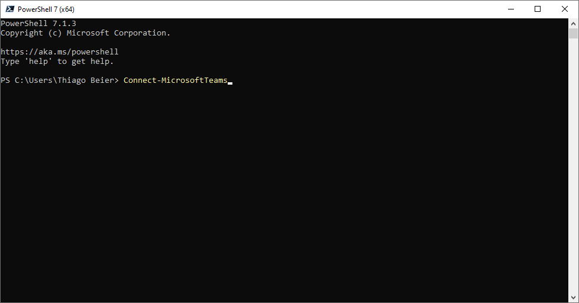
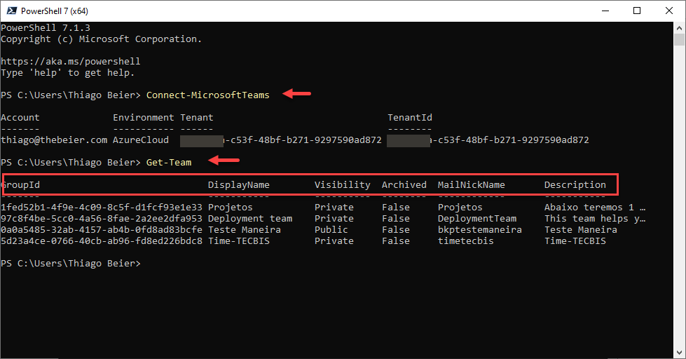

Hi there

This post is being written on July 5^th^, 2021

Have you replaced your Skype for Business Online PowerShell module by
Teams PowerShell module already?

{width="6.5in" height="6.506944444444445in"}

If you haven't, please check the following steps

**Check your current powershell version**

**\$PSVersionTable.PSVersion**

Microsoft recommends that you use the Install-Module cmdlet to install
the Microsoft Teams PowerShell module.

**Install-Module -Name PowerShellGet -Force -AllowClobber**

You might need to trust on the PSGet repository

+-----------------------------------------------------------------------+
| Untrusted repository                                                  |
|                                                                       |
| You are installing the modules from an untrusted repository. If you   |
| trust this repository, change                                         |
|                                                                       |
| its InstallationPolicy value by running the \`**Set-PSRepository**\`  |
| cmdlet.                                                               |
|                                                                       |
| Are you sure you want to install the modules from \'PSGallery\'?      |
|                                                                       |
| \[Y\] Yes \[A\] Yes to All \[N\] No \[L\] No to All \[S\] Suspend     |
| \[?\] Help (default is \"N\"):                                        |
+=======================================================================+
+-----------------------------------------------------------------------+

{width="6.5in" height="1.03125in"}

**Signing in**

**Connect-MicrosoftTeams**

I also tested the same experience on PowerShell 7 (version 7.1.3 from
2021-03-11)

<https://github.com/PowerShell/PowerShell/releases/tag/v7.1.3>

{width="6.5in" height="3.3993055555555554in"}

Authenticate on web browser

{width="6.5in" height="0.6069444444444444in"}

{width="6.5in" height="3.3993055555555554in"}
